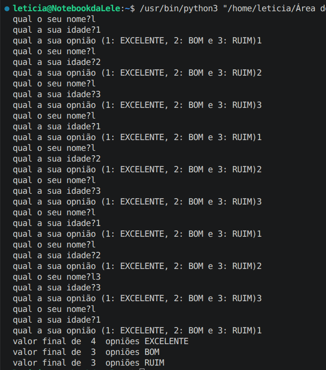

# Pesquisa de opinião — Agenda 8

Atividade de Desenvolvimento de Sistemas I da ETEC sobre estruturas de repetição.

## Proposta da atividade

O enunciado pede uma pesquisa de opinião com **50 pessoas**, solicitando o nome, a idade e a avaliação de cada participante. Ao final, o programa deve mostrar quantas pessoas escolheram cada uma das três opções:

- **1 — EXCELENTE**
- **2 — BOM**
- **3 — RUIM**

## Versão de teste com 10 pessoas

Para testar o funcionamento sem precisar preencher os dados de 50 pessoas a cada execução, fiz esta versão com **10 participantes**. Assim, consegui conferir a entrada de dados, a repetição das perguntas e a contagem de cada opinião com um teste mais rápido.

O laço `for` utiliza `range(1, 11)`, que executa o bloco 10 vezes, pois o limite final não é incluído. Em cada repetição, o programa solicita nome, idade e opinião. A estrutura `match/case` identifica a opção escolhida e soma 1 ao contador correspondente: `excelente`, `bom` ou `ruim`.

Depois das 10 participações, o programa mostra o total de avaliações em cada categoria. O nome e a idade são coletados, mas não entram no cálculo desses totais.

Para executar a pesquisa com as **50 pessoas solicitadas no enunciado**, basta trocar:

```python
for i in range(1,11):
```

por:

```python
for i in range(1,51):
```

O código publicado mantém 10 participantes para reproduzir o teste apresentado abaixo.

## Como executar

Com Python **3.10 ou superior**, abra esta pasta no terminal e execute:

```bash
python3 "Pesquisa de opniao.py"
```

Preencha nome, idade inteira e opinião para cada participante.

## Teste de funcionamento

No exemplo, foram informadas 10 opiniões, com resultado de **4 EXCELENTE**, **3 BOM** e **3 RUIM**.



## Autora

**Letícia Polatto**  
Desenvolvimento de Sistemas I — Agenda 8
